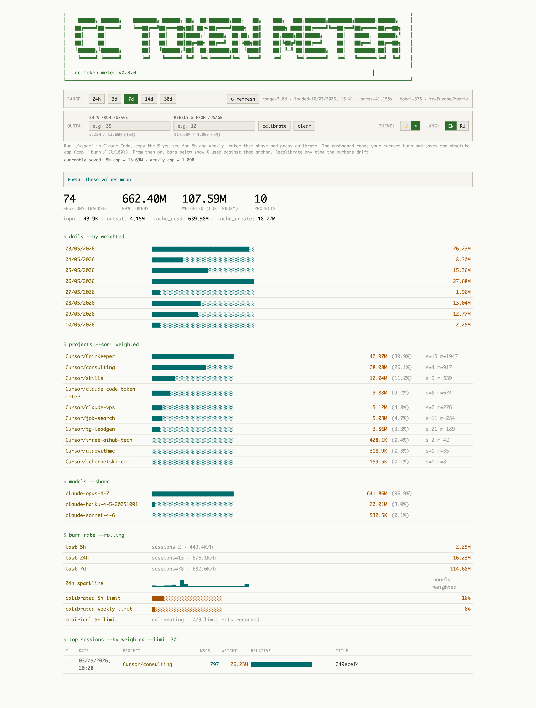

# claude-code-token-meter

Local-first dashboard for [Claude Code](https://claude.com/claude-code) token usage.
Parses your local session logs (`~/.claude/projects/*/*.jsonl`) and serves an
interactive viewer on `localhost`. **No API calls. Zero tokens spent on viewing.**



## Why

Claude Code writes a JSONL log per session under `~/.claude/projects/`. Those
files contain everything you need to understand your usage — input, output,
cache-read and cache-create tokens per message — but there's no built-in way to
explore them.

This tool parses them, aggregates per session, and exposes:

- **Daily breakdown** — weighted tokens per day
- **Project breakdown** — share of usage by project
- **Model share** — opus / sonnet / haiku split
- **Top 30 sessions** — biggest individual sessions, with the rest collapsed
  into a single "other sessions beyond top 30" line
- **Date filter** — 24h / 3d / 7d / 14d / 30d, switched without page reload

The "weighted" number uses Anthropic's published cost ratios as a proxy:

```
weighted = input × 1 + output × 5 + cache_create × 1.25 + cache_read × 0.1
```

It's not a literal subscription-quota percentage (Anthropic doesn't publish
that formula), but it gives the right *relative* ranking of sessions and days.

## Install

Requires Python 3.10+.

```bash
pipx install claude-code-token-meter
```

Or from source:

```bash
git clone https://github.com/itregdisrapp/claude-code-token-meter.git
cd claude-code-token-meter
python -m venv .venv
source .venv/bin/activate
pip install -e .
```

## Run

```bash
claude-code-token-meter
claude-code-token-meter --port 8000
PORT=8000 claude-code-token-meter
claude-code-token-meter --projects-dir /path/to/.claude/projects
```

The `--projects-dir` flag is useful if your Claude Code state lives outside the
default `~/.claude/projects` (e.g. on an external drive or in a custom
`CLAUDE_CODE_HOME`).

Or without installing globally:

```bash
python -m claude_code_token_meter
```

Then open the dashboard in your browser:

**http://127.0.0.1:3378** (default — or `http://127.0.0.1:<PORT>` if you overrode it)

The first request triggers a one-time parse of all JSONL files (~5–15 s for
hundreds of sessions). Results are cached in memory; click **↻ refresh** in the
UI to re-scan after new sessions.

## API

The dashboard fetches a single JSON endpoint — useful if you want to script
your own reports.

```bash
curl http://127.0.0.1:3378/api/stats?days=7 | jq '.summary'
curl http://127.0.0.1:3378/api/stats?start=2026-05-01&end=2026-05-08'
curl -X POST http://127.0.0.1:3378/api/refresh    # re-parse from disk
```

Response shape:

```json
{
  "summary": { "sessions_tracked": ..., "raw_total": ..., "weighted_total": ... },
  "daily":    [ { "date": "...", "weighted": ... } ],
  "projects": [ { "project": "...", "weighted": ..., "share_pct": ..., "sessions": ..., "msgs": ... } ],
  "models":   [ { "model": "...", "raw": ..., "share_pct": ... } ],
  "top_sessions":   [ { "session_id": "...", "title": "...", "date": "...", "project": "...", "msgs": ..., "weighted": ... } ],
  "other_sessions": { "count": ..., "weighted": ... },
  "range": { "start": "...", "end": "...", "days": ... },
  "meta":  { "projects_dir": "...", "sessions_total": ..., "loaded_at": "...", "parse_seconds": ..., "version": "..." }
}
```

## Auto-start at login (macOS, optional)

Save as `~/Library/LaunchAgents/com.user.claude-code-token-meter.plist`:

```xml
<?xml version="1.0" encoding="UTF-8"?>
<!DOCTYPE plist PUBLIC "-//Apple//DTD PLIST 1.0//EN" "http://www.apple.com/DTDs/PropertyList-1.0.dtd">
<plist version="1.0">
<dict>
  <key>Label</key><string>com.user.claude-code-token-meter</string>
  <key>ProgramArguments</key>
  <array>
    <string>/path/to/.venv/bin/claude-code-token-meter</string>
  </array>
  <key>RunAtLoad</key><true/>
  <key>KeepAlive</key><true/>
</dict>
</plist>
```

```bash
launchctl load ~/Library/LaunchAgents/com.user.claude-code-token-meter.plist
```

## Develop

```bash
pip install -e ".[dev]"
pytest
```

CI runs `pytest` on Python 3.10–3.13 via GitHub Actions
(`.github/workflows/test.yml`).

## License

MIT
